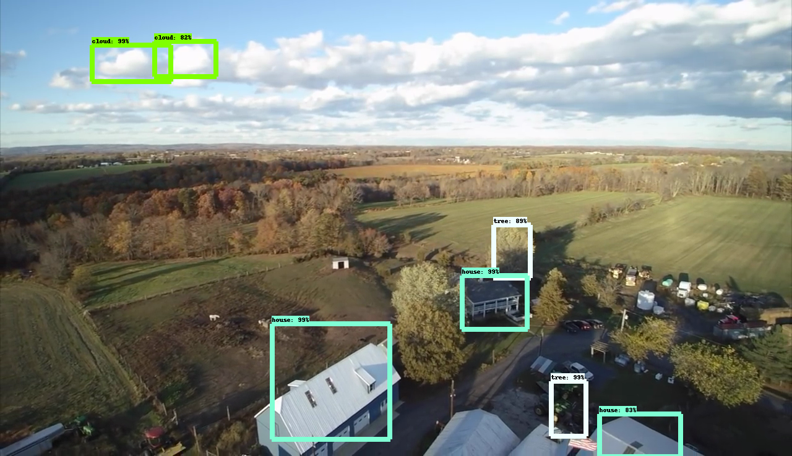
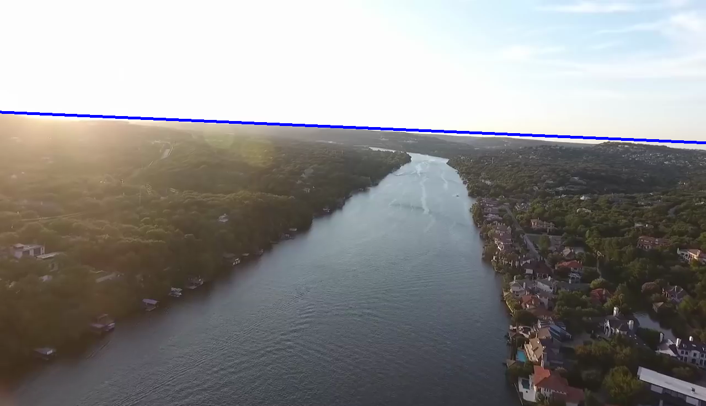
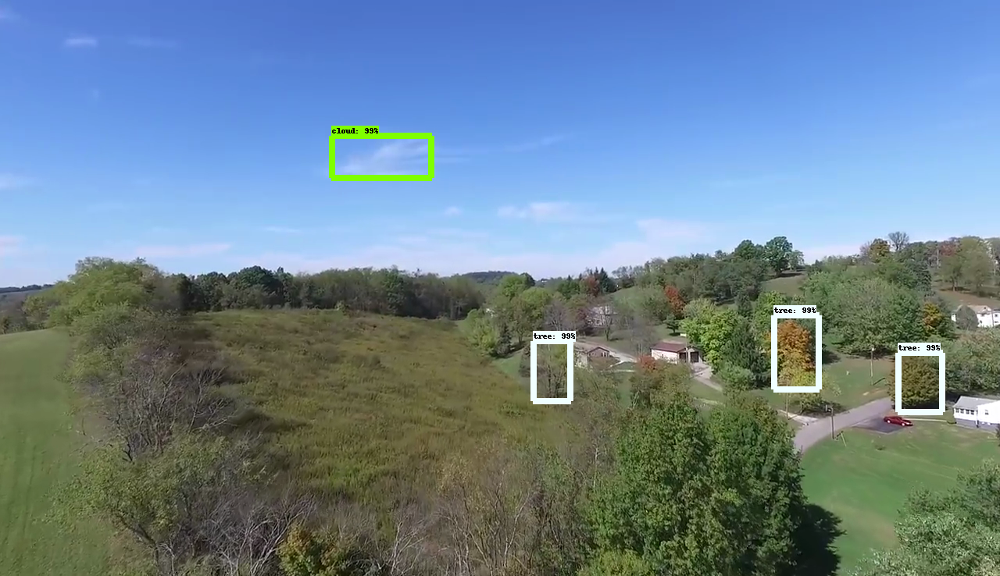
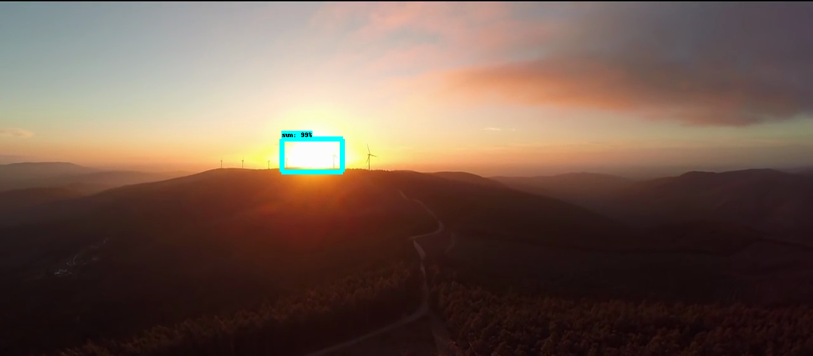
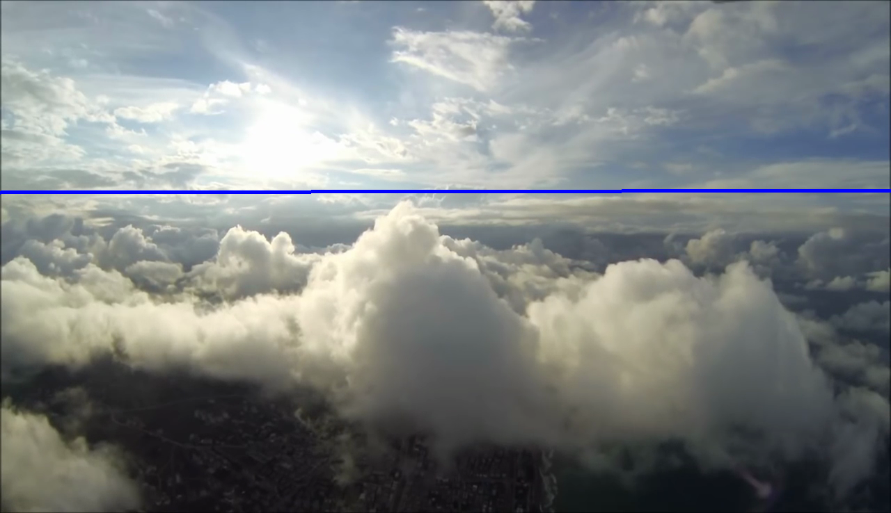
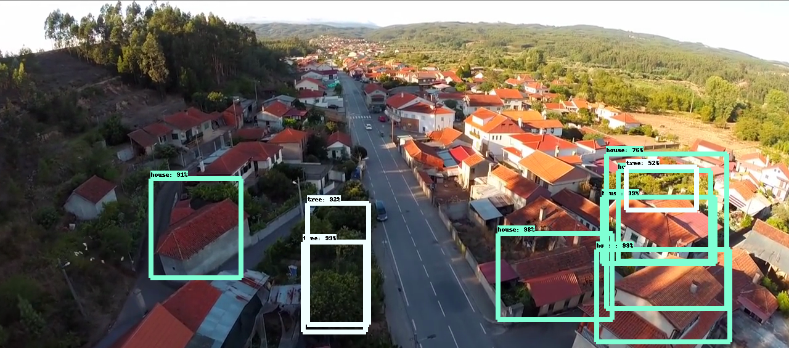
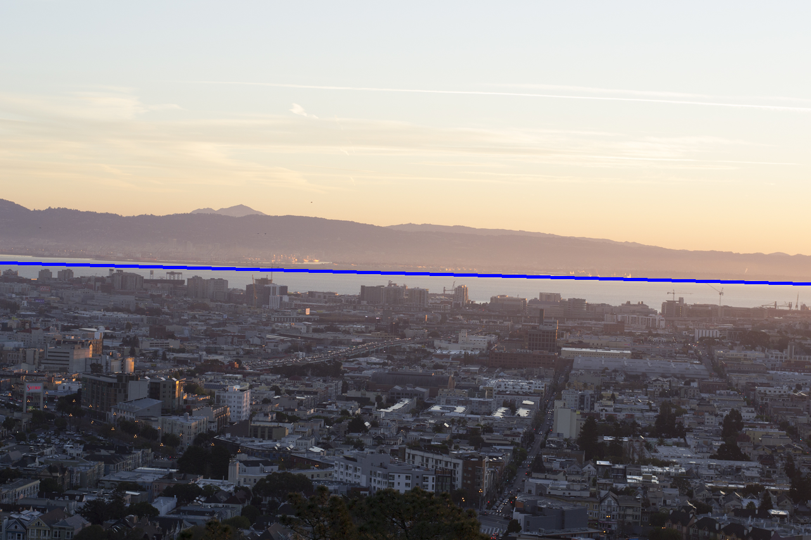

# Iris Drone Challenge

This is a submission to the [Iris Challenge](https://www.irisonboard.com/challenge/). Taken from the challenge instructions:

***There are 31 images in the dataset. They are all taken from drones in a range of different environments.Provide us with as much contextual awareness about these environments as you possibly can. We want to automatically understand everything about the 
scene in the way a human pilot might.***

This repo contains two parts:
 - Object detection model for clouds, sun, houses, and trees
 - Horizon line detector

*Detector*

The detector (`detector/*`) uses the TF Object Detection API. The procedure is as follows:
 - Find images on the internet, use [LabelImg](https://github.com/tzutalin/labelImg) to label them (I used a tiny dataset of 20 images)
 - Generate TFRecords files for training using `detector/generate_dataset.ipynb`
 - Train a model from a pre-trained coco OD model using `detector/train_model.ipynb`
 - Run the saved model on the the challenge test_images using `detector/run_model.ipynb`

*Horizon Angle*

The horizon angle regression model (`horizon/*`) uses OpenCV built-ins. The procedure is as follows:
 - Preprocess image (gray, blurring)
 - Use Canny Edge Detection on image, dilate the resulting edges
 - Use Hough Line Transform to get lines, fine tune parameters as needed
 - Average the resulting Hough Lines to get the horizon
 
## Results

Below are some *hand-picked* results. (Find more in `output_images/*`)

## Requirements

- Python 3.5
- [TensorFlow](https://www.tensorflow.org/) 0.14
- [Jupyter Notebooks](https://github.com/jupyter/notebook)
- [OpenCV](https://opencv.org/opencv-3-3.html) 3.3

## Author

Hugo Ponte
